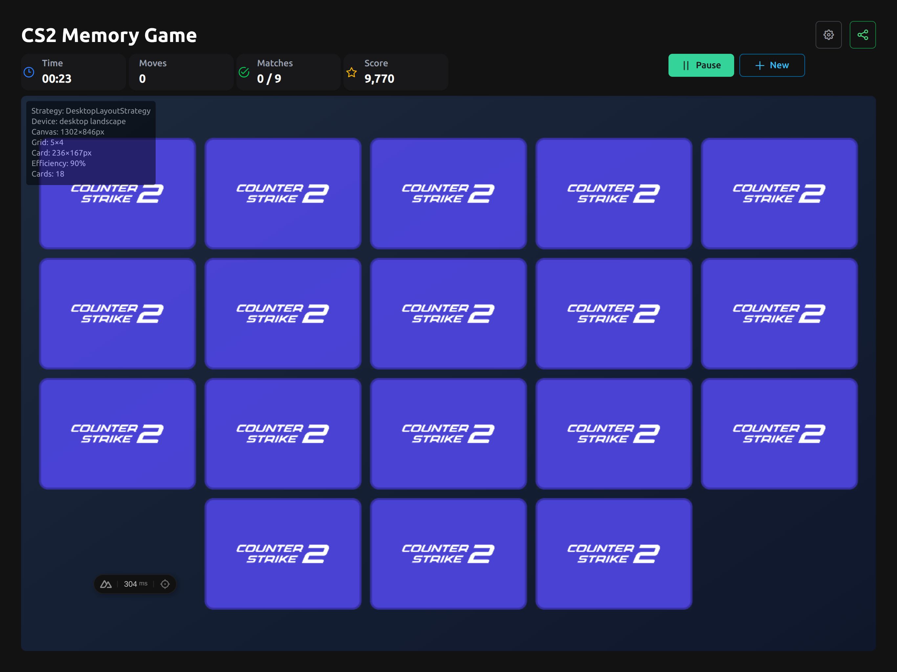

# 🎮 CS2 Memory Game

A browser-based memory card matching game featuring Counter-Strike 2 weapons and items, built with modern web technologies.



## ✨ Key Features

- 🎨 Canvas-based rendering with PixiJS
- 🎯 Multiple difficulty levels (12, 18, 24 cards)
- 🎲 Seed-based randomization with QR sharing
- 💎 CS2 rarity-based card designs
- 🔊 Audio feedback (flip.mp3, match.mp3)
- 💾 Game persistence & statistics

## 🚀 Quick Start

```bash
# Clone and install
git clone https://github.com/your-username/cs2-memory-game.git
cd cs2-memory-game
npm install

# Start development server
npm run dev
```

Open `http://localhost:3000` in your browser! 🌐

## 📚 Documentation

For detailed information, see the [documentation](./docs/):

- 🎮 [Overview](./docs/overview.md) - Features and project description
- 🛠️ [Tech Stack](./docs/tech-stack.md) - Technologies used
- 🏗️ [Architecture](./docs/architecture.md) - Technical design
- 🚀 [Getting Started](./docs/getting-started.md) - Setup instructions
- 👨‍💻 [Development](./docs/development.md) - Scripts and workflow
- 🎯 [Project Scope](./docs/project-scope.md) - Current and future features
- 📊 [Status](./docs/status.md) - Development progress

## 🛠️ Tech Stack

**Frontend:** Nuxt 3, Vue 3, TypeScript, Tailwind CSS, PixiJS  
**Testing:** Vitest, Playwright  
**Storage:** localStorage with CS2 API integration

## 📄 License

License information will be added upon project completion.

---

🎯 **Target**: CS2 players and memory game enthusiasts  
🌐 **Platform**: Web browsers (desktop & mobile)
